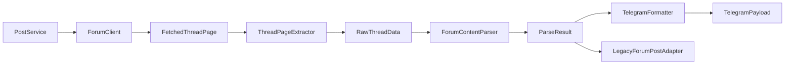
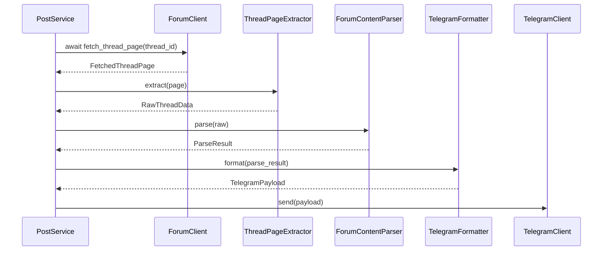

# Design Document

## Overview

This refactor converts Keylol thread processing from a monolithic string-building flow into an incremental pipeline:

1. fetch thread HTML
2. extract root-post metadata and HTML
3. parse a minimal structured content model
4. render a typed Telegram delivery payload
5. adapt structured output back into legacy interfaces during migration

The design is intentionally narrower than the original proposal. The current codebase has one forum source, one delivery channel, and an existing ForumPost model that still needs to work. The first version should solve the real coupling problems without introducing a generic plugin framework or broad abstractions that have only one implementation.

## Current Problems

- ForumClient mixes session management, HTML traversal, and Telegram-oriented string assembly.
- ForumPost combines lazy loading, transport access, and Telegram presentation.
- Forum transport is still synchronous and does not align with the bot's async execution model.
- The earlier design proposed repositories, can_handle methods, and plugin systems before there was a second parser or formatter to justify them.

## Goals

- separate transport, extraction, parsing, rendering, and legacy adaptation
- keep the current bot behavior available during migration
- model the root post with typed, minimally sufficient structured data
- return a typed delivery payload instead of a raw string
- adopt native async forum transport with httpx

## Non-Goals

- a cross-forum plugin system in phase 1
- reply-tree parsing beyond the thread root post
- a generalized multi-platform formatter framework in phase 1

## Architecture

### High-Level Architecture



### Runtime Flow



## Components and Contracts

### 1. ForumClient as Async Transport Gateway

ForumClient should remain responsible for:

- authentication and login state
- session persistence
- httpx.AsyncClient lifecycle, request headers, timeouts, and retries
- detection of login expiry or transport-level failures

ForumClient should no longer be responsible for:

- extracting title, author, publish time, or tags from HTML
- flattening HTML into Telegram-ready strings
- deciding how links, images, Steam widgets, or quotes render in Telegram

Recommended transport output:

```python
@dataclass(frozen=True)
class FetchedThreadPage:
    thread_id: int
    url: str
    html: str
    fetched_at: datetime
```

Recommended transport shape:

```python
class ForumClient:
    def __init__(self, ..., http_client: httpx.AsyncClient | None = None):
        ...

    async def fetch_thread_page(self, thread_id: int) -> FetchedThreadPage:
        ...
```

### 2. ThreadPageExtractor

ThreadPageExtractor converts a fetched page into the raw structured input needed by the parser. It owns page-level HTML extraction but not forum transport and not Telegram rendering.

```python
@dataclass(frozen=True)
class RootPostMetadata:
    thread_id: int
    root_post_id: int
    title: str
    author: str
    publish_time: datetime
    url: str
    tags: tuple[str, ...] = ()
    forum_extra: Mapping[str, Any] = field(default_factory=dict)


@dataclass(frozen=True)
class RawThreadData:
    metadata: RootPostMetadata
    root_post_html: str
    page_html: str | None = None
```

Responsibilities:

- find the thread title and root post container
- extract author, publish time, root_post_id, tags, and canonical URL
- return the raw HTML fragment for the root post body
- raise a typed extraction error when the page structure is missing required anchors

### 3. Structured Content Model

Phase 1 uses a minimal AST rather than a large inheritance tree. The point is to preserve ordering and recoverable semantics, not to model every possible HTML nuance on day one.

```python
@dataclass(frozen=True)
class PostContent:
    metadata: RootPostMetadata
    elements: tuple[ContentElement, ...]

    def to_plain_text(self) -> str: ...
    def media_urls(self) -> tuple[str, ...]: ...


@dataclass(frozen=True)
class ContentElement:
    kind: str


@dataclass(frozen=True)
class TextElement(ContentElement):
    text: str
    bold: bool = False
    italic: bool = False


@dataclass(frozen=True)
class LinkElement(ContentElement):
    url: str
    text: str


@dataclass(frozen=True)
class ImageElement(ContentElement):
    url: str
    alt_text: str | None = None


@dataclass(frozen=True)
class QuoteElement(ContentElement):
    children: tuple[ContentElement, ...]


@dataclass(frozen=True)
class EmbedElement(ContentElement):
    provider: str
    url: str
    label: str | None = None


@dataclass(frozen=True)
class LineBreakElement(ContentElement):
    pass


@dataclass(frozen=True)
class UnknownElement(ContentElement):
    raw_html: str
    text_fallback: str
```

This model is sufficient to represent the content currently handled in the legacy parser: text, links, images, block quotes, line breaks, and embedded content such as Steam widgets or video links.

### 4. Parser Contract

The parser contract should expose one stable method and return structured diagnostics. The earlier can_handle design is unnecessary because phase 1 has one concrete parser.

```python
@dataclass(frozen=True)
class ParseIssue:
    code: str
    message: str
    context: Mapping[str, Any] = field(default_factory=dict)


@dataclass(frozen=True)
class ParseResult:
    content: PostContent
    fallback_text: str
    warnings: tuple[ParseIssue, ...] = ()
    errors: tuple[ParseIssue, ...] = ()
    used_fallback: bool = False

    @property
    def is_successful(self) -> bool:
        return not self.errors


class ThreadContentParser(Protocol):
    def parse(self, raw: RawThreadData) -> ParseResult: ...
```

ForumContentParser should:

- parse the root_post_html fragment into the minimal AST
- preserve ordering of source elements
- degrade malformed nodes to TextElement or UnknownElement
- populate fallback_text even when structured parsing is only partially successful
- emit warnings and errors with stable issue codes

Element-specific parsing helpers may exist internally, but they do not need to be public extension points yet.

### 5. Telegram Rendering Contract

Phase 1 should not return a bare string from the formatter. Rendering should produce a typed payload that the Telegram client can send directly.

```python
@dataclass(frozen=True)
class TelegramPayload:
    text: str
    media_urls: tuple[str, ...] = ()
    disable_web_page_preview: bool = False
    parse_mode: str | None = None
```

TelegramFormatter should accept ParseResult rather than re-reading raw HTML:

```python
class TelegramFormatter:
    def format(self, result: ParseResult) -> TelegramPayload:
        ...
```

This keeps Telegram-specific rules in one place:

- Markdown escaping or plain-text rendering strategy
- quote formatting
- link presentation
- media attachment decisions
- preview behavior

Phase 1 does not need a generic formatter base class. If a second delivery target appears later, a shared protocol can be extracted without changing the structured content contract.

### 6. PostProcessingService

PostProcessingService orchestrates the new pipeline and gives the rest of the application one place to call.

```python
@dataclass(frozen=True)
class ProcessedThread:
    raw: RawThreadData
    parse_result: ParseResult
    telegram_payload: TelegramPayload


class PostProcessingService:
    async def process_thread(self, thread_id: int) -> ProcessedThread:
        ...
```

Responsibilities:

- await ForumClient async methods backed by httpx
- run extraction, parsing, and Telegram formatting in sequence
- surface diagnostics in one result object
- provide a temporary adapter back to legacy ForumPost behavior where needed

### 7. Legacy Compatibility Layer

Backward compatibility should be implemented through adapters, not by keeping transport and formatting logic inside domain objects.

Recommended migration approach:

- keep ForumPost available as an integration-facing model during migration
- derive ForumPost.content from ParseResult.fallback_text or PostContent.to_plain_text()
- move lazy loading into a loader or adapter layer instead of storing ForumClient inside immutable value objects
- deprecate ForumPost.to_telegram_message in favor of TelegramFormatter and TelegramPayload

This preserves existing bot behavior while allowing the old string-building code to be removed later.

## Error Handling

### Failure Categories

1. Transport failures stay in ForumClient as typed network or authentication exceptions.
2. Extraction failures raise a typed extractor error with thread context.
3. Parser failures are mostly recoverable and should be captured as ParseIssue instances plus fallback text.
4. Formatter failures should fall back to plain-text TelegramPayload generation, not trigger a second parse.

### Fallback Strategy

- If one node fails, degrade that node to TextElement or UnknownElement.
- If the tree is only partially parsed, keep structured output and mark used_fallback.
- If the structured parse fails completely, deliver fallback_text through TelegramPayload.text.
- If Telegram formatting cannot preserve a feature, prefer plain, readable text over failing delivery.

## Testing Strategy

### Unit Tests

- ThreadPageExtractor tests from stored full-page HTML fixtures
- ForumContentParser tests from root-post HTML fragments
- TelegramFormatter tests from constructed ParseResult objects
- adapter tests for legacy ForumPost.content compatibility

### Regression Tests

- golden HTML fixtures copied from real Keylol threads
- side-by-side comparison of legacy message text and new payload.text for a curated sample set
- focused cases for Steam widgets, quotes, inline links, images, and hidden content markers

### Type Safety

- configure pyright for the new structured-processing modules
- require typed constructor inputs for value objects
- validate required metadata fields at extraction time

## Design Decisions and Rationale

### 1. Split Fetching from Extraction
ForumClient currently mixes network access and content shaping. Separating page fetch from HTML extraction gives the refactor a clear first seam while the transport layer moves to httpx.

### 2. Adopt httpx for Native Async Transport
The bot already runs inside async services, so forum transport should stop relying on blocking requests calls. httpx provides async HTTP support, cookie handling, connection pooling, and a migration path that is simpler than keeping a long-term sync shim.

### 3. Use a Minimal AST First
The codebase needs order preservation, links, quotes, embeds, and media references. It does not need a large public parser plugin framework in phase 1.

### 4. Return TelegramPayload Instead of str
The current flow already distinguishes text from images conceptually. A typed payload makes this explicit and avoids flattening structured content too early.

### 5. Keep Backward Compatibility in Adapters
Legacy consumers still exist. Adapters let the system preserve ForumPost.content while removing presentation logic from the data model over time.

### 6. Defer Plugin Systems Until a Second Consumer Exists
Extensibility should be based on real pressure from another forum source or renderer, not on speculative abstractions.