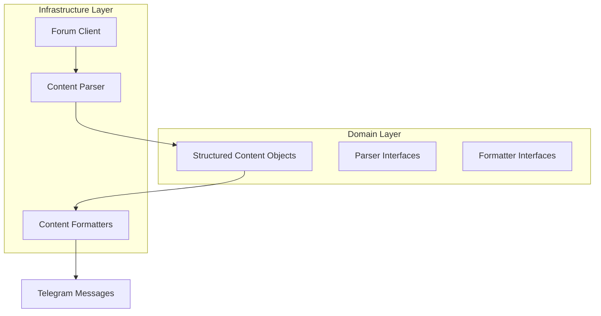
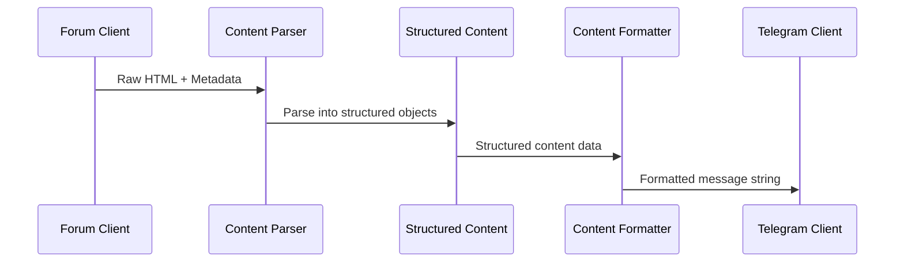
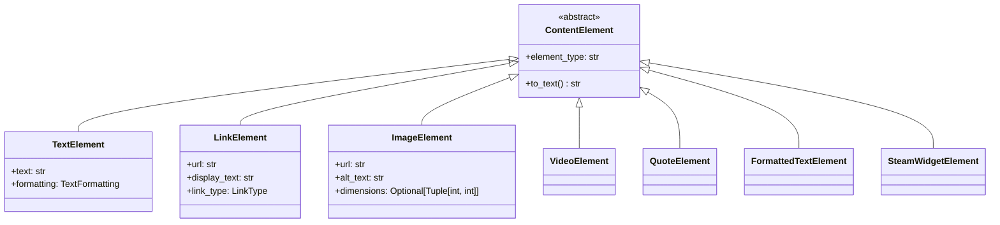
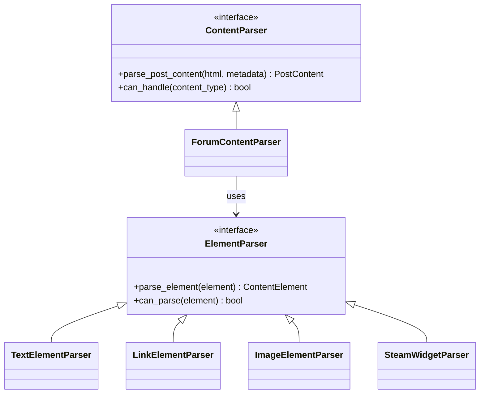

# Design Document

## Overview

This design transforms the current string-based post content parsing in the forum client into a comprehensive structured data approach. The solution implements a layered architecture that separates data extraction, content parsing, and formatting concerns while maintaining type safety and extensibility.

The design follows clean architecture principles with clear separation of concerns:
- **Forum Client**: Responsible only for raw HTML extraction and basic metadata
- **Content Parser**: Transforms raw HTML into structured content objects
- **Content Formatters**: Handle presentation-specific formatting (Telegram, etc.)
- **Domain Models**: Type-safe data structures representing forum content

## Architecture

### High-Level Architecture



### Data Flow Architecture



## Components and Interfaces

### 1. Core Domain Models

#### PostContent (Value Object)
```python
@dataclass(frozen=True)
class PostContent:
    """Immutable structured representation of forum post content"""
    elements: List[ContentElement]
    metadata: PostMetadata
    
    def get_text_content(self) -> str:
        """Extract plain text from all elements"""
    
    def get_media_urls(self) -> List[str]:
        """Extract all media URLs"""
    
    def get_links(self) -> List[LinkElement]:
        """Extract all link elements"""
```

#### ContentElement (Abstract Base)
```python
@dataclass(frozen=True)
class ContentElement(ABC):
    """Base class for all content elements"""
    element_type: str
    
    @abstractmethod
    def to_text(self) -> str:
        """Convert element to plain text representation"""

# Concrete implementations:
# - TextElement: Plain text content
# - LinkElement: Hyperlinks with URL and display text
# - ImageElement: Images with URL and alt text
# - VideoElement: Embedded videos
# - QuoteElement: Quoted content blocks
# - CodeElement: Code blocks or inline code
# - FormattedTextElement: Bold, italic, etc.
```

#### PostMetadata (Value Object)
```python
@dataclass(frozen=True)
class PostMetadata:
    """Post metadata extracted from forum"""
    post_id: int
    thread_id: int
    title: str
    author: str
    publish_time: datetime
    url: str
    tags: List[str]
    forum_specific_data: Dict[str, Any]  # Extensible metadata
```

### 2. Parser Layer

#### ContentParser (Interface)
```python
class ContentParser(ABC):
    """Abstract interface for content parsing"""
    
    @abstractmethod
    def parse_post_content(self, html_content: str, metadata: PostMetadata) -> PostContent:
        """Parse HTML content into structured PostContent"""
    
    @abstractmethod
    def can_handle(self, content_type: str) -> bool:
        """Check if parser can handle specific content type"""
```

#### ForumContentParser (Implementation)
```python
class ForumContentParser(ContentParser):
    """Keylol forum-specific content parser"""
    
    def __init__(self):
        self._element_parsers: Dict[str, ElementParser] = {
            'text': TextElementParser(),
            'link': LinkElementParser(),
            'image': ImageElementParser(),
            'video': VideoElementParser(),
            'quote': QuoteElementParser(),
            'steam_widget': SteamWidgetParser(),
        }
    
    def parse_post_content(self, html_content: str, metadata: PostMetadata) -> PostContent:
        """Parse forum HTML into structured content"""
```

### 3. Formatter Layer

#### ContentFormatter (Interface)
```python
class ContentFormatter(ABC):
    """Abstract interface for content formatting"""
    
    @abstractmethod
    def format_post(self, post_content: PostContent) -> str:
        """Format structured content for specific output"""
    
    @abstractmethod
    def get_format_type(self) -> str:
        """Return the format type this formatter handles"""
```

#### TelegramFormatter (Implementation)
```python
class TelegramFormatter(ContentFormatter):
    """Telegram-specific content formatter"""
    
    def format_post(self, post_content: PostContent) -> str:
        """Format content for Telegram with markdown support"""
    
    def _format_element(self, element: ContentElement) -> str:
        """Format individual content elements"""
```

### 4. Updated Forum Client

The ForumClient will be refactored to focus solely on data extraction:

```python
class ForumClient:
    """Simplified forum client focused on data extraction"""
    
    def load_post_raw_data(self, thread_id: int) -> Optional[RawPostData]:
        """Extract raw HTML and basic metadata only"""
        return RawPostData(
            html_content=html_content,
            metadata=PostMetadata(...)
        )
```

### 5. Service Layer Integration

```python
class PostProcessingService:
    """Orchestrates post parsing and formatting"""
    
    def __init__(self, parser: ContentParser, formatter: ContentFormatter):
        self._parser = parser
        self._formatter = formatter
    
    def process_post(self, raw_post_data: RawPostData) -> str:
        """Process raw post data into formatted output"""
        structured_content = self._parser.parse_post_content(
            raw_post_data.html_content, 
            raw_post_data.metadata
        )
        return self._formatter.format_post(structured_content)
```

## Data Models

### Content Element Hierarchy



### Parser Strategy Pattern



## Error Handling

### Parsing Error Strategy

1. **Graceful Degradation**: If specific element parsing fails, fall back to text extraction
2. **Error Context**: Preserve error information for debugging while maintaining functionality
3. **Validation**: Type-safe validation at each parsing stage

```python
@dataclass
class ParseResult:
    """Result of parsing operation with error handling"""
    content: PostContent
    errors: List[ParseError]
    warnings: List[ParseWarning]
    
    @property
    def is_successful(self) -> bool:
        return len(self.errors) == 0
```

### Error Recovery Mechanisms

- **Element-level fallback**: Failed elements become TextElements with raw content
- **Parser fallback**: If structured parsing fails completely, fall back to current string-based approach
- **Validation errors**: Clear error messages for type mismatches and schema violations

## Testing Strategy

### Unit Testing Approach

1. **Parser Testing**: Test each ElementParser independently with known HTML fragments
2. **Formatter Testing**: Test formatters with known PostContent structures
3. **Integration Testing**: End-to-end testing with real forum HTML samples
4. **Type Safety Testing**: Ensure all data structures maintain type constraints

### Test Data Strategy

```python
# Test fixtures for different content types
SAMPLE_HTML_FRAGMENTS = {
    'simple_text': '<p>Simple text content</p>',
    'steam_widget': '<iframe src="https://store.steampowered.com/widget/123456/">',
    'image_with_link': '<a href="image.jpg"></a>',
    'complex_quote': '<blockquote><p>Quoted content</p></blockquote>'
}

# Expected structured output for each fragment
EXPECTED_PARSED_CONTENT = {
    'simple_text': PostContent(elements=[TextElement(text="Simple text content")]),
    # ... more test cases
}
```

### Mock Strategy

- **Forum Client Mocking**: Mock HTML responses for consistent testing
- **Parser Interface Mocking**: Test formatters independently of parsing logic
- **Formatter Mocking**: Test service layer without format-specific concerns

## Design Decisions and Rationales

### 1. Immutable Value Objects
**Decision**: Use frozen dataclasses for all content structures
**Rationale**: Ensures data integrity, enables safe sharing between components, and prevents accidental mutations that could cause inconsistencies

### 2. Strategy Pattern for Parsers
**Decision**: Separate parser for each content element type
**Rationale**: Enables easy extension for new content types, maintains single responsibility principle, and allows independent testing of parsing logic

### 3. Separation of Parsing and Formatting
**Decision**: Distinct layers for content parsing and output formatting
**Rationale**: Enables multiple output formats (Telegram, Discord, etc.) without duplicating parsing logic, and allows format-specific optimizations

### 4. Lazy Loading Preservation
**Decision**: Maintain lazy loading pattern in ForumPost model
**Rationale**: Preserves existing performance characteristics while enabling structured data when needed

### 5. Backward Compatibility
**Decision**: Maintain existing ForumPost interface while adding structured content support
**Rationale**: Enables gradual migration without breaking existing functionality, reduces deployment risk

### 6. Type Safety Throughout
**Decision**: Strong typing for all data structures and interfaces
**Rationale**: Catches errors at development time, improves IDE support, and ensures data integrity across component boundaries

### 7. Extensible Metadata
**Decision**: Include forum_specific_data field in PostMetadata
**Rationale**: Allows for forum-specific features without modifying core data structures, supports future extensibility

This design provides a robust foundation for structured post data while maintaining the existing system's performance characteristics and enabling future enhancements like content filtering, advanced formatting, and multi-platform support.