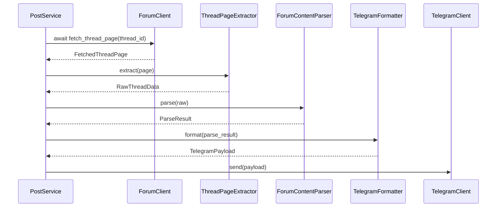

# Design Document

## Overview

Keylol thread forwarding now runs through a single structured pipeline:

1. fetch thread HTML
2. extract root-post metadata and HTML
3. parse structured post content
4. render a typed Telegram payload
5. send the payload through TelegramClient

The codebase has one forum source and one delivery target. The runtime design therefore stays narrow: no plugin system, no secondary renderer abstraction, and no compatibility adapter path back to deprecated output flows. `ForumPost` remains only as a minimal latest-post summary model.

## Current Problems

- `ForumClient` still carries transport complexity and must stay isolated from rendering concerns.
- HTML extraction rules are forum-specific and should stay out of transport code.
- Structured parsing must keep graceful fallback behavior for malformed forum markup.
- The delivery path should not reintroduce legacy string-building or lazy-loading models.

## Goals

- separate transport, extraction, parsing, rendering, and delivery concerns
- keep structured processing as the only production forwarding path
- preserve typed contracts for fetched pages, parsed content, and delivery payloads
- keep `ForumPost` as a minimal summary dataclass for latest-post listings
- continue using native async forum transport with httpx

## Non-Goals

- a cross-forum plugin system in phase 1
- full reply-tree parsing beyond the thread root post
- a generalized multi-platform formatter framework in phase 1
- reintroducing rollout flags, compare mode, or deprecated fallback send paths

## Architecture

### High-Level Architecture


### Runtime Flow



## Components and Contracts

### 1. ForumClient as Transport Gateway

`ForumClient` remains responsible for:

- authentication and login state
- session persistence
- httpx async client lifecycle, request headers, timeouts, and retries
- detection of login expiry and transport-level failures

`ForumClient` should not be responsible for:

- extracting title, author, publish time, or tags from HTML
- flattening HTML into Telegram-ready strings
- deciding how links, images, quotes, or embeds render in Telegram

Transport output stays typed:

```python
@dataclass(frozen=True)
class FetchedThreadPage:
    thread_id: int
    url: str
    html: str
    fetched_at: datetime
```

### 2. Extraction Layer

The extractor layer owns forum-specific HTML traversal.

- `KeylolLatestPostsPageExtractor` produces `ForumPost` summary items from the guide page.
- `KeylolThreadPageExtractor` produces `RawThreadData` for the root post.

The extractor contract keeps required metadata explicit:

```python
@dataclass(frozen=True)
class RootPostMetadata:
    thread_id: int
    root_post_id: int
    title: str
    author: str
    publish_time: datetime
    url: str
    tags: tuple[str, ...] = ()


@dataclass(frozen=True)
class RawThreadData:
    metadata: RootPostMetadata
    root_post_html: str
    page_html: str | None = None
```

Responsibilities:

- find the thread title and root post container
- extract author, publish time, root-post id, tags, and canonical URL
- return the raw HTML fragment for the root-post body
- raise typed extraction errors when required anchors are missing

### 3. Structured Content Model

The parser returns a minimal structured AST that preserves ordering and recoverable semantics.

```python
@dataclass(frozen=True)
class PostContent:
    metadata: RootPostMetadata
    elements: tuple[ContentElement, ...]

    def to_plain_text(self) -> str: ...
    def media_urls(self) -> tuple[str, ...]: ...
```

The element set remains intentionally small: text, links, images, quotes, embeds, line breaks, and unknown fallback nodes.

### 4. Parser Contract

The parser exposes a single stable method and returns diagnostics plus fallback text.

```python
@dataclass(frozen=True)
class ParseIssue:
    code: str
    message: str
    context: Mapping[str, Any] = field(default_factory=dict)


@dataclass(frozen=True)
class ParseResult:
    content: PostContent
    fallback_text: str
    warnings: tuple[ParseIssue, ...] = ()
    errors: tuple[ParseIssue, ...] = ()
    used_fallback: bool = False
```

`ForumContentParser` should:

- parse the root-post HTML fragment into the minimal AST
- preserve source order
- degrade malformed nodes to text or unknown content instead of aborting the parse
- populate `fallback_text` even when structured parsing is only partially successful
- emit stable issue codes and debugging context

### 5. Telegram Rendering Contract

Rendering returns a typed payload rather than a raw string.

```python
@dataclass(frozen=True)
class TelegramPayload:
    text: str
    media_urls: tuple[str, ...] = ()
    disable_web_page_preview: bool = False
    parse_mode: str | None = None
```

`TelegramFormatter` consumes `ParseResult` and owns Telegram-specific decisions:

- Markdown or plain-text rendering strategy
- link presentation
- quote formatting
- media attachment decisions
- preview behavior

### 6. PostProcessingService and PostService

`PostProcessingService` is the structured pipeline entry point:

```python
@dataclass(frozen=True)
class ProcessedThread:
    raw: RawThreadData
    parse_result: ParseResult
    telegram_payload: TelegramPayload
```

Responsibilities:

- await `ForumClient` fetch methods
- run extraction, parsing, and formatting in sequence
- return a single result object with diagnostics and delivery payload

`PostService` then consumes that result for channel polling and single-thread requests. It no longer owns a deprecated output branch or compare mode.

### 7. ForumPost Boundary

`ForumPost` now stays intentionally small:

- it is a dataclass with `id`, `title`, `url`, and `author`
- it represents latest-post list items only
- it does not lazy-load content
- it does not know how to format Telegram messages
- it is not part of the structured thread-processing contract beyond linking a list item to a thread id

## Error Handling

### Failure Categories

1. Transport failures stay in `ForumClient` as typed network or authentication exceptions.
2. Extraction failures raise typed extractor errors with thread context.
3. Parser failures are mostly recoverable and should surface as `ParseIssue` entries plus fallback text.
4. Formatter failures should degrade to readable text payloads rather than triggering a second parse.

### Fallback Strategy

- If one node fails, degrade that node to text or unknown content.
- If the tree is only partially parsed, keep structured output and mark `used_fallback`.
- If the structured parse fails completely, deliver `fallback_text` through `TelegramPayload.text`.
- If Telegram formatting cannot preserve a feature, prefer readable text over failed delivery.

## Testing Strategy

### Unit Tests

- thread-page extractor tests from stored full-page HTML fixtures
- forum-content parser tests from root-post HTML fragments
- Telegram formatter tests from constructed `ParseResult` objects
- PostService rollout tests that assert structured delivery remains the only send path

### Regression Tests

- golden HTML fixtures copied from real Keylol threads
- focused cases for Steam widgets, quotes, inline links, images, and hidden content markers
- latest-post list extraction tests that keep `ForumPost` minimal

### Type Safety

- configure pyright for the structured-processing modules
- require typed constructor inputs for value objects
- validate required metadata fields at extraction time

## Design Decisions and Rationale

### 1. Split Fetching from Extraction

Transport and HTML shaping evolve at different speeds. Keeping them separate makes the forum client easier to reason about and test.

### 2. Use httpx for Native Async Transport

The bot already runs inside async services. httpx provides async HTTP support, cookie handling, connection pooling, and a cleaner long-term fit than blocking requests-based shims.

### 3. Keep the AST Minimal

The codebase needs order preservation, links, quotes, embeds, and media references. It does not need a public parser plugin framework yet.

### 4. Return TelegramPayload Instead of str

A typed payload delays flattening and makes text, media, and preview decisions explicit.

### 5. Keep One Production Path

Once structured delivery is verified, compatibility layers should be deleted so the runtime has one authoritative send path and one source of truth for parsed content.

### 6. Defer Plugin Systems Until a Second Consumer Exists

Extensibility should be driven by a real second forum source or renderer, not speculative abstraction.
